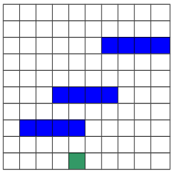

<h1 align="center">
    
</h1>

  <a href="#-projeto">Projeto</a>
  &nbsp;&nbsp;&nbsp;|&nbsp;&nbsp;&nbsp;
  <a href="#-entrada-de-dados">Entrada de dados</a>
  &nbsp;&nbsp;&nbsp;|&nbsp;&nbsp;&nbsp;
  <a href="#-saída-de-dados">Saída de dados</a>

## ✦ Projeto

O trabalho prático teve como objetivo projetar e implementar um algoritmo, na linguagem C, que tem como ideia de funcionamento o **backtracking** para o contexto de um labirinto. A tabela abaixo representa um mapa, onde cada célula representa um quadrado. Temos neste espaço um cachorro, cuja posição inicial está representada por um quadrado verde. O cachorro deverá caminhar pelos vários quadrados até chegar em uma das células da primeira linha da tabela. Os quadrados azuis representam paredes, pelas quais o cachorro obviamente não pode passar. O cachorro só pode se movimentar para cima, para baixo e para os lados. Ou seja, não pode se movimentar nas diagonais.

    

## ✦ Entrada de dados

O mapa é a entrada para o programa, a partir de um arquivo texto. O arquivo tem um formato padronizado, sendo que na primeira linha do arquivo temos o número de linhas, um espaço e um número de colunas. Nas linhas seguintes são informadas as cores de cada uma das células, de cada linha, sendo que as células de cada linha não são separadas por espaço. Cada cor é representada por um número de 1 a 3, sendo:

- 1 - Branco: célula vazia, por onde o cachorro pode passar
- 2 - Verde: célula onde o cachorro está
- 3 - Azul: célula representa uma parede

## ✦ Saída de dados

O programa imprime a resposta na tela. Cada posição ocupada pelo cachorro é ser impressa em uma linha da saída. Ao final da execução e da impressão de todas as células pelas quais o cachorro passou, é impresso a quantidade total de movimentos feitos e em qual coluna da primeira linha o cachorro chegou. Além disso o labirinto em questão pode não ter saída! Nesse caso o cachorro pára na célula em que estiver quando perceber que não há saída e o resultado (labirinto sem saída) é impresso pelo programa.

---

O projeto foi desenvolvido, para fins didáticos, durante a disciplina de Projeto e Análise de Algoritmos do curso de Bacharelado em Ciência da Computação da UFV – Campus Florestal

